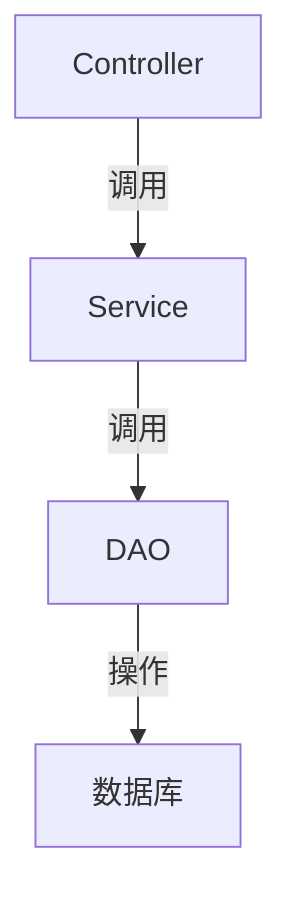

# Hướng dẫn hiểu mã bằng AI

## 🧠 Phương pháp luận để hiểu mã

### 1. Phương pháp hiểu theo tầng
- **Tầng kiến trúc**: Hiểu cấu trúc tổng thể dự án và stack công nghệ
- **Tầng mô-đun**: Phân tích cách phân chia mô-đun chức năng và quan hệ tương tác
- **Tầng lớp**: Nghiên cứu trách nhiệm và giao diện của các lớp cốt lõi
- **Tầng phương thức**: Hiểu logic triển khai của từng phương thức cụ thể

### 2. Theo dõi chuỗi gọi


### 3. Liên kết ngữ cảnh
- Truy vết lên trên: Phương thức này được ai gọi?
- Đi sâu xuống dưới: Phương thức này gọi những phương thức nào khác?
- Liên hệ ngang: Có phương thức khác nào có chức năng tương tự không?

## 🔍 Phân tích mã cốt lõi

### 1. Tầng Controller
```php
// 典型控制器方法
public function createOrder() {
    // 1. 参数验证
    $params = $this->request->post();
    $this->validate($params);

    // 2. 调用服务层
    $orderId = $orderService->createOrder($params);

    // 3. 返回结果
    return $this->success(['order_id' => $orderId]);
}
```

### 2. Tầng Service
```php
// 典型服务方法
public function createOrder($params) {
    // 1. 校验商品
    $this->checkProducts($params['products']);

    // 2. 计算价格
    $amount = $this->calculateAmount($params);

    // 3. 创建订单
    $orderId = $this->orderDao->create([
        'user_id' => $params['user_id'],
        'amount' => $amount,
        'status' => 'unpaid'
    ]);

    // 4. 扣减库存
    $this->productService->deductStock($params['products']);

    return $orderId;
}
```

### 3. Tầng DAO
```php
// 典型DAO方法
public function create($data) {
    $data['create_time'] = time();
    return Db::name('order')->insertGetId($data);
}
```

## 📚 Lộ trình học mã

### 1. Lộ trình nhập môn
1. Bắt đầu từ điểm vào controller để hiểu luồng nghiệp vụ
2. Theo dõi phần triển khai service của nghiệp vụ cốt lõi
3. Tìm hiểu các thao tác truy cập dữ liệu cơ bản

### 2. Lộ trình nâng cao
1. Nghiên cứu cơ chế xử lý ngoại lệ
2. Phân tích cách triển khai middleware
3. Hiểu cơ chế sự kiện và lắng nghe

### 3. Lộ trình chuyên sâu
1. Nghiên cứu các điểm tối ưu hiệu năng
2. Phân tích các biện pháp bảo mật
3. Hiểu cơ chế mở rộng

## 💡 Mẹo để hiểu mã

### 1. Mẹo debug
```php
// 使用日志输出关键变量
Log::info('Order create params: ' . json_encode($params));

// 使用断点调试
xdebug_break();
```

### 2. Công cụ trực quan hóa
- Dùng công cụ UML để vẽ sơ đồ lớp
- Dùng sơ đồ tuần tự để mô tả luồng gọi
- Dùng sơ đồ tư duy để hệ thống mô-đun chức năng

### 3. Hỗ trợ từ tài liệu
- Kết hợp tài liệu API để hiểu tham số
- Tham khảo từ điển cơ sở dữ liệu để hiểu cấu trúc dữ liệu
- Xem test case để nắm hành vi kỳ vọng

## 🛠️ Giải quyết vấn đề thường gặp

### 1. Làm sao định vị nhanh logic nghiệp vụ?
- Tìm kiếm theo từ khóa liên quan (ví dụ tên phương thức, tên bảng)
- Theo dõi thay đổi của các bảng dữ liệu cốt lõi
- Phân tích chuỗi gọi trong log

### 2. Làm sao hiểu thuật toán phức tạp?
- Chia nhỏ thành các bước để kiểm chứng từng phần
- Viết unit test để kiểm tra điều kiện biên
- Dùng công cụ trực quan để hiển thị luồng dữ liệu

### 3. Làm sao đánh giá chất lượng mã?
- Kiểm tra phân tầng có rõ ràng không
- Đánh giá độ phủ unit test
- Phân tích mức độ lặp mã
- Kiểm tra xử lý ngoại lệ đã đầy đủ chưa

---

> **Gợi ý**: Tài liệu này được AI tạo ra, chỉ mang tính tham khảo.
