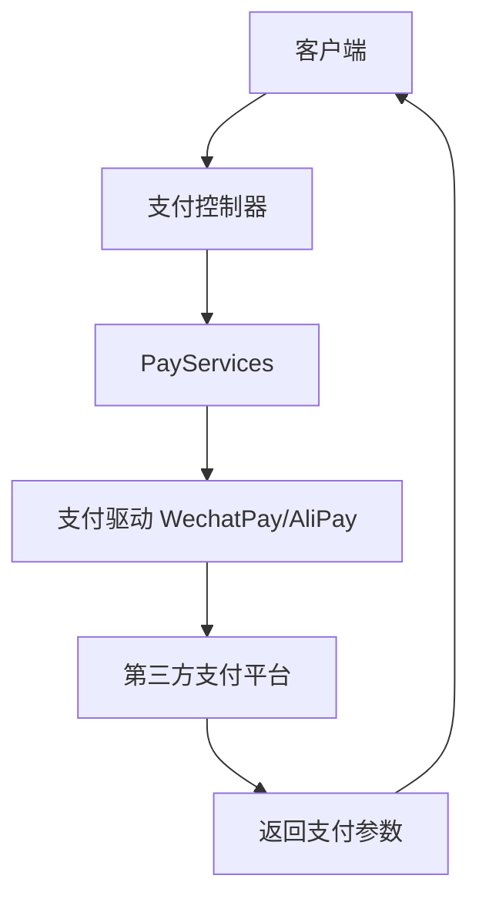
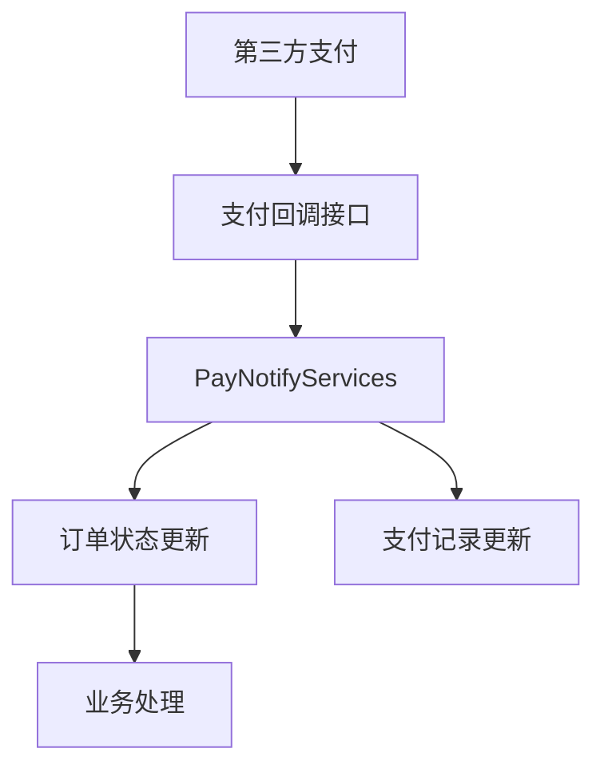

# Tài liệu quy trình phát triển thanh toán CRMEB

## 🎯 Tổng quan về chức năng thanh toán

Dựa trên phân tích hệ thống thanh toán của CRMEB phiên bản 5.6.4+, dự án áp dụng kiến ​​trúc dịch vụ thanh toán thống nhất và hỗ trợ tích hợp nhiều phương thức thanh toán.

### Phương thức thanh toán được hỗ trợ
```php
// app/services/pay/PayServices.php
const WEIXIN_PAY = 'weixin';      // 微信支付
const YUE_PAY = 'yue';            // 余额支付
const OFFLINE_PAY = 'offline';    // 线下支付
const ALIAPY_PAY = 'alipay';      // 支付宝
const ALLIN_PAY = 'allinpay';     // 通联支付
const FRIEND = 'friend';          // 好友代付
const BANK = 'bank';              // 银行转账
```

##🏗️ Kiến trúc hệ thống thanh toán

### Cấu trúc lớp dịch vụ cốt lõi
```
app/services/pay/
├── PayServices.php          # 统一支付入口服务
├── OrderPayServices.php     # 订单支付服务
├── PayNotifyServices.php    # 支付回调服务
├── YuePayServices.php       # 余额支付服务
└── RechargeServices.php     # 充值服务

crmeb/services/pay/
├── Pay.php                  # 支付基础驱动
├── storage/
│   ├── WechatPay.php        # 微信支付驱动
│   ├── AliPay.php           # 支付宝驱动
│   ├── AllinPay.php         # 通联支付驱动
│   └── V3WechatPay.php      # 微信支付V3驱动
```

###Quy trình thanh toán

#### 1. Quy trình yêu cầu thanh toán


#### 2. Quy trình gọi lại thanh toán


## 🔧 Phân tích mã lõi

### Cổng thanh toán thống nhất (PayServices.php)
```php
public function pay(string $payType, string $orderId, string $price, string $successAction, string $body, array $options = [])
{
    try {
        // 支付类型映射处理
        if (in_array($payType, ['routine', 'weixinh5', 'weixin', 'pc', 'store'])) {
            $payType = 'wechat_pay';
            // V3接口判断
            if (sys_config('pay_wechat_type') == 1) {
                $payType = 'v3_wechat_pay';
            }
        } elseif ($payType == 'alipay') {
            $payType = 'ali_pay';
        } elseif ($payType == 'allinpay') {
            $payType = 'allin_pay';
        }

        // 创建支付实例
        $pay = app()->make(Pay::class, [$payType]);

        return $pay->create($orderId, $price, $successAction, $body, '', $options);

    } catch (\Exception $e) {
        throw new ApiException($e->getMessage());
    }
}
```

### Trình điều khiển thanh toán Wechat (WechatPay.php)
```php
public function create(string $orderId, string $totalFee, string $attach, string $body, string $detail, array $options = [])
{
    $this->authSetPayType();

    switch ($this->payType) {
        case Order::NATIVE:   // 扫码支付
            return WechatService::nativePay(null, $orderId, $totalFee, $attach, $body, $detail);
        case Order::APP:      // APP支付
            return WechatService::appPay($options['openid'], $orderId, $totalFee, $attach, $body, $detail);
        case Order::JSAPI:    // 小程序/公众号支付
            if (request()->isRoutine()) {
                // 小程序支付
                if ($options['pay_new_weixin_open']) {
                    return MiniProgramService::newJsPay($options['openid'], $orderId, $totalFee, $attach, $body, $detail, $options);
                }
                return MiniProgramService::jsPay($options['openid'], $orderId, $totalFee, $attach, $body, $detail);
            }
            return WechatService::jsPay($options['openid'], $orderId, $totalFee, $attach, $body, $detail);
        case 'h5':            // H5支付
            return WechatService::paymentPrepare(null, $orderId, $totalFee, $attach, $body, $detail, 'MWEB');
        default:
            throw new PayException('微信支付:支付类型错误');
    }
}
```

### Xử lý gọi lại thanh toán (PayNotifyServices.php)
```php
public function wechatProduct(string $order_id = null, string $trade_no = null, string $payType = PayServices::WEIXIN_PAY)
{
    try {
        $services = app()->make(StoreOrderSuccessServices::class);
        $orderInfo = $services->getOne(['order_id' => $order_id]);

        if (!$orderInfo) return true;
        if ($orderInfo->paid) return true;

        return $services->paySuccess($orderInfo->toArray(), $payType, ['trade_no' => $trade_no]);
    } catch (\Exception $e) {
        return false;
    }
}
```

## 🛠️ Hướng dẫn phát triển

###1. Cài đặt cấu hình thanh toán
Quản lý cấu hình hệ thống ở chế độ nền:
- Thông số thanh toán WeChat (APPID, số người bán, khóa API, chứng chỉ)
- Cấu hình Alipay
- Cấu hình thanh toán Tonglian
- Chuyển đổi phương thức thanh toán

### 2. Bắt đầu cuộc gọi thanh toán
```php
// 在控制器中调用
public function createPayment()
{
    $params = $this->request->post();

    // 参数验证
    validate(PaymentValidate::class)->scene('create')->check($params);

    $payServices = app()->make(PayServices::class);
    $result = $payServices->pay(
        $params['pay_type'],
        $params['order_id'], 
        $params['amount'],
        url('api/v1/payment/notify/wechat', [], true, true),
        '商品购买'
    );

    return $this->success($result);
}
```

### 3. Cấu hình gọi lại thanh toán
```php
// 路由配置
Route::post('api/v1/payment/notify/:type', 'api/v1/payment/notify');

// 回调控制器
public function notify($type)
{
    $notifyService = app()->make(PayNotifyServices::class);

    switch ($type) {
        case 'wechat':
            return $notifyService->wechatProduct(
                $this->request->post('out_trade_no'),
                $this->request->post('transaction_id')
            );
        case 'alipay':
            // 支付宝回调处理
            break;
    }

    return response('SUCCESS');
}
```

## 🧪 Hướng dẫn kiểm tra

### Ví dụ về kiểm thử đơn vị
```php
class PaymentTest extends TestCase
{
    public function testWechatPaymentCreation()
    {
        $payService = new PayServices();
        $result = $payService->pay(
            'weixin', 
            'TEST20240117001', 
            '100.00', 
            'https://domain.com/notify',
            '测试商品'
        );

        $this->assertArrayHasKey('timeStamp', $result);
        $this->assertArrayHasKey('nonceStr', $result);
        $this->assertArrayHasKey('package', $result);
    }
}
```

### Cấu hình môi trường Sandbox
```bash
# 微信支付沙箱
WECHAT_SANDBOX=true
WECHAT_APPID=sandbox_appid
WECHAT_MCHID=sandbox_mchid

# 支付宝沙箱
ALIPAY_SANDBOX=true
ALIPAY_GATEWAY=https://openapi.alipaydev.com/gateway.do
```

## 📊 Thiết kế cơ sở dữ liệu

### Bảng ghi thanh toán (eb_store_pay)
```sql
CREATE TABLE `eb_store_pay` (
  `id` int(10) UNSIGNED NOT NULL AUTO_INCREMENT,
  `uid` int(10) UNSIGNED NOT NULL DEFAULT '0' COMMENT '用户id',
  `oid` int(10) UNSIGNED NOT NULL DEFAULT '0' COMMENT '订单id',
  `order_id` varchar(32) NOT NULL DEFAULT '' COMMENT '订单号',
  `out_trade_no` varchar(32) NOT NULL DEFAULT '' COMMENT '支付流水号',
  `pay_type` varchar(20) NOT NULL DEFAULT '' COMMENT '支付方式',
  `pay_price` decimal(10,2) UNSIGNED NOT NULL DEFAULT '0.00' COMMENT '支付金额',
  `trade_no` varchar(64) DEFAULT NULL COMMENT '第三方支付流水号',
  `paid` tinyint(1) UNSIGNED NOT NULL DEFAULT '0' COMMENT '支付状态',
  `pay_time` int(10) UNSIGNED DEFAULT NULL COMMENT '支付时间',
  `add_time` int(10) UNSIGNED NOT NULL DEFAULT '0' COMMENT '创建时间',
  PRIMARY KEY (`id`),
  UNIQUE KEY `out_trade_no` (`out_trade_no`),
  KEY `order_id` (`order_id`),
  KEY `paid` (`paid`)
) ENGINE=InnoDB COMMENT='支付记录表';
```

## 🚀 Triển khai và vận hành

### Cấu hình môi trường sản xuất
```bash
# 微信支付配置
WECHAT_APPID=your_appid
WECHAT_MCHID=your_mchid
WECHAT_KEY=your_key
WECHAT_CERT_PATH=/path/to/cert.pem
WECHAT_KEY_PATH=/path/to/key.pem

# SSL证书配置
ssl_certificate /path/to/ssl/cert.pem;
ssl_certificate_key /path/to/ssl/key.pem;
```

### Giám sát cảnh báo
```php
// 支付监控指标
$metrics = [
    'payment_success_rate' => ($successCount / $totalCount) * 100,
    'payment_response_time' => microtime(true) - $startTime,
    'payment_error_count' => $errorCount
];

// 日志记录
Log::info('支付监控', $metrics);
```

## 🔧 Khắc phục sự cố

###Câu hỏi thường gặp
1. **Gọi lại thanh toán không thành công**: Kiểm tra cấu hình nginx, chứng chỉ SSL, tường lửa
2. **Lỗi chữ ký**: Đang xác minh cấu hình khóa thanh toán
3. **Số tiền không nhất quán**: Kiểm tra đơn vị số tiền và tính toán chiết khấu
4. **Thanh toán trùng lặp**: Thêm cơ chế chống trùng lặp và kiểm tra trạng thái

###Điều trị cấp cứu
```bash
# 查看支付日志
tail -f runtime/log/payment.log

# 禁用问题支付方式
php think pay:disable weixin

# 启用备用支付
php think pay:enable alipay
```

---
**Phiên bản tài liệu**: v2.0
**Ngày cập nhật**: 2024-01-17
**Phiên bản áp dụng**: CRMEB 5.6.4+

💡 Mẹo: Chức năng thanh toán liên quan đến bảo mật quỹ, vui lòng tuân thủ nghiêm ngặt các quy định bảo mật và tiến hành kiểm tra bảo mật thường xuyên.

---

> **Mẹo**: Tài liệu này được tạo bởi AI và chỉ mang tính chất tham khảo.
